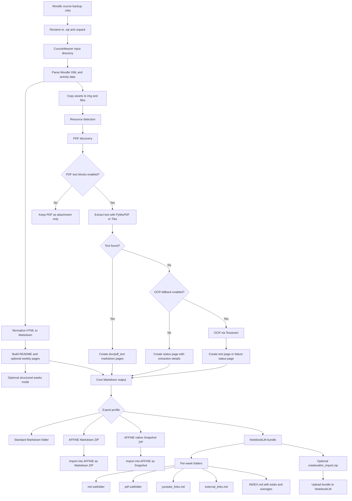

In this semester I was happy to welcome new students to our MA E-Learning and Media-Education. One of my students is visually impaired and his level of blindness increases. While we offer a lot of digital learning resources I was not aware how challenging a normal study mode would be for him. During my lectures I became aware how my teaching style and especially the use of slides depends of connecting the visual channel with the auditive channel. While only my spoken presentation hopefully also serves as a good input for knowledge acqusition, the digital learning material which we offer via Moodle was far from being accessible due to numerous reasons (file formats like PDF, visualizations, lack of clear structure. )

CourseWeaver is a practical conversion pipeline for turning unpacked Moodle backups into structured outputs for different downstream workflows:

- clean Markdown for documentation and publishing
- AFFiNE-ready ZIP and Snapshot formats
- NotebookLM folder bundles with per-week structure

The project started as an extension of an existing Moodle-to-Markdown converter and gradually evolved into a broader workflow tool with a local Web UI, PDF text extraction, OCR fallback, and export profiles for different targets.

## Why this workflow matters

Many Moodle exports contain mixed HTML, links, embedded media, and attached files. That is useful in Moodle itself, but hard to reuse in modern knowledge workflows.

CourseWeaver solves this by creating a reproducible transformation pipeline:

1. Normalize Moodle content into readable Markdown.
2. Preserve assets (images, files, PDFs).
3. Build target-specific bundles for AFFiNE and NotebookLM.
4. Keep the process accessible through both CLI and Web UI.

## End-to-end workflow

## Main output targets

### 1. Markdown workspace output

This is the baseline output and usually includes:

- `README.md`
- optional `doc/*.md` weekly pages
- `img/` and `files/` asset folders
- optional `doc/pdf_text/` pages when PDF extraction is active

### 2. AFFiNE exports

CourseWeaver supports two AFFiNE-oriented formats:

- Markdown ZIP import package (`*_affine.zip`)
- native Snapshot ZIP (`*_affine_native.zip`)

This allows users to choose between a Markdown-centered import path and a more native snapshot import path.

### 3. NotebookLM bundle

The NotebookLM export profile creates a dedicated structure under `notebooklm_import/`.

For each week:

- `md/` contains week-local markdown pages
- `pdf/` contains linked PDF files
- `youtube_links.md` contains extracted YouTube references
- `external_links.md` contains other external links

Additionally, an `INDEX.md` is generated with per-week counters, total counts, and average-per-week metrics.

## Web UI and CLI

CourseWeaver can be used in two ways:

- CLI for reproducible, scriptable runs
- local Web UI for easier option discovery and non-terminal workflows

The Web UI exposes all key options, including:

- structured weeks
- week pages
- native week page behavior for snapshot export
- PDF extraction and OCR settings
- NotebookLM bundle and ZIP creation

## Typical use cases

- archive and republish teaching materials as clean Markdown
- move course knowledge into AFFiNE with richer media handling
- create upload-ready bundles for NotebookLM-based synthesis
- document course assets with transparent extraction and conversion metadata

## Closing note

CourseWeaver is best understood as a workflow orchestrator: one input format, multiple high-quality output targets, and explicit control over extraction steps.

That design makes it easier to move from LMS-contained course data to reusable knowledge assets across tools and contexts.

## Short version for social media

CourseWeaver turns Moodle backups into structured knowledge bundles for Markdown, AFFiNE, and NotebookLM. The workflow includes HTML cleanup, asset handling, optional PDF text extraction with OCR fallback, and target-specific export profiles. The new post includes an end-to-end Mermaid diagram of the complete pipeline.

Suggested short post:

I published a new write-up on CourseWeaver: an end-to-end workflow from Moodle backup to Markdown, AFFiNE, and NotebookLM bundles. Includes a full Mermaid flow diagram and practical export structure details.
